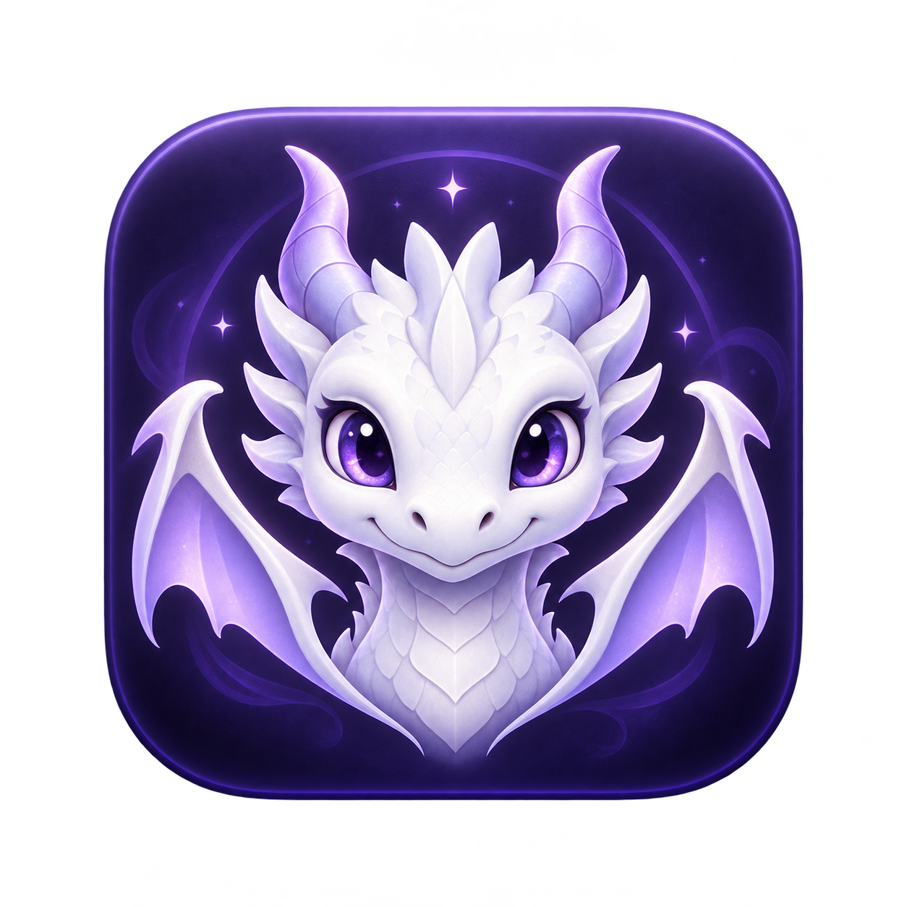

# Dragon Codex Boot — Mac



给 macOS 版 Codex 播放随附龙娘启动动画，让真实客户端画面从动画里的屏幕逐步放大，最后交回真实窗口。Fork 自 [yushua0808-cpu/dragon-codex-boot](https://github.com/yushua0808-cpu/dragon-codex-boot)，原 Windows 实现完整保留，见 [Windows 使用说明](docs/windows-readme.md)。独立社区项目，与 OpenAI 无隶属关系。

## Mac 上怎么用

要求 macOS 13+、已安装 Codex。通用应用包含 Apple Silicon / Intel 两种架构；运行时不需要 Python、Node、API key，实时画面嵌入需要给 Dragon Codex Boot 授予屏幕录制权限；不需要辅助功能权限。

### 从源码构建

先安装 Apple 的 Xcode Command Line Tools（已安装 Xcode 可跳过）：

```bash
xcode-select --install
```

```bash
git clone https://github.com/swtxbling/dragon-codex-boot-mac.git
cd dragon-codex-boot-mac
bash scripts/test-mac.sh
open "build/Dragon Codex Boot.app"
```

把 `build/Dragon Codex Boot.app` 复制到 `~/Applications` 或 `/Applications`，双击启动，也可以拖到 Dock。应用内部包含视频和配置，移动应用后依然可以使用。打开这个入口才播放动画；直接打开官方 Codex 仍使用官方启动方式。

构建脚本只写仓库的 `build/`，不会替换官方应用、已有 Dock 图标或系统入口。卸载时退出并删除这个独立应用，再移除对应 Dock 图标即可。

### 下载构建包

[GitHub Actions](https://github.com/swtxbling/dragon-codex-boot-mac/actions/workflows/macos.yml) 的成功运行会附带 `DragonCodexBoot-mac-universal`，包含应用 ZIP 和 SHA-256 文件。下载 Actions 附件需要登录 GitHub。

本项目目前使用本地 ad-hoc 签名，没有 Apple Developer ID 签名或公证。联网下载的包可能被 Gatekeeper 拦截；核实来源后按 macOS「系统设置 → 隐私与安全性 → 仍要打开」流程操作，或自行从源码构建。不要关闭系统安全保护。

## 首次授权

打开应用后，启动器直接尝试 ScreenCaptureKit 的实际窗口捕获；macOS 首次使用时可能显示系统授权提示。若实际接口明确拒绝权限，启动器才显示「前往授权」，到 macOS「系统设置 → 隐私与安全性 → 屏幕与系统音频录制」允许 **Dragon Codex Boot**，再重新打开应用。macOS 13 的设置项可能叫「屏幕录制」。授权只需在本机系统界面完成，启动器不再仅因 Core Graphics 预检返回 false 就拦截启动。

公开构建默认使用临时 ad-hoc 签名，重新构建后旧授权可能不再匹配。若有权使用本机有效的 Apple Development 或 Developer ID Application 证书，可使用固定签名身份构建本机应用：

```bash
DRAGON_MAC_SIGNING_IDENTITY="<证书名称或 SHA-1>" bash scripts/build-mac.sh
```

后续构建、测试、打包都会重建本机应用，应沿用同一 `DRAGON_MAC_SIGNING_IDENTITY`，避免默认构建将本机签名改回 ad-hoc。不要使用已撤销或过期的证书。打包脚本仍将公开 ZIP 重新签为 ad-hoc，不会默认分发本机开发证书签署的应用。系统仍掌管授权与提醒，固定签名不能替代首次授权。

实际捕获只使用启动后 Codex 的进程 ID、应用标识和一个可见主窗口 ID，画面经 ScreenCaptureKit 在本机内存中显示，没有文件录制、音频采集或上传。应用退出、Esc、超时或捕获失败时停止捕获并释放帧。需要撤销时在相同系统设置关闭权限。

若实际接口拒绝授权，可选「本次只播放动画」：使用对齐后的淡出交接，不提供实时画面嵌入。没有有效首帧或其他捕获错误直接回退到这个模式，不再误报为权限问题。

## 播放与交接

- 覆盖 Codex 的完整窗口，视频保持比例，空余区域用统一底色遮住；已打开客户端时使用它的窗口位置和大小。
- 同时通过 macOS 原生应用启动接口打开 Codex；已运行时复用现有应用。
- 11.3 秒等待真实窗口与首个直播帧就绪；12.65–13.65 秒按原视频屏幕关键帧放大实时界面，最终匹配真实窗口，再进行短交接。
- Esc 立即隐藏并静音动画，启动完成后激活 Codex。最迟 60 秒退出等待并显示错误。
- 缺失或无法解码视频时继续交接到 Codex；找不到应用、启动失败、无响应超时会显示错误。

Mac 版使用 ScreenCaptureKit 实时窗口画面，按动画播放时间连续改变位置、大小和透明度。移动和调整的是启动器覆盖窗口，真实 Codex 的位置与尺寸保持原样。直播阶段不可操作缩小的界面；交接完成后操作真实客户端。首帧就绪不保证所有后台任务加载完成。

## 配置与自定义视频

右键应用 → 显示包内容，编辑 `Contents/Resources/launcher.json`。构建时默认来自 [Mac 配置](config/launcher.macos.json)，重复构建保留已有配置。由 0.1.x 升级时，可用公开模板更新 `transitionStart`、`transitionEnd` 和 `screenFrames`；原有配置缺少新字段时会用兼容默认值。

| 字段 | 含义 |
| --- | --- |
| `video` | 相对 `Contents/Resources` 的视频路径，或绝对路径；默认 `media/startup.mp4` |
| `appBundleIdentifier` | 默认 `com.openai.codex`，按标识查找，不依赖 `.app` 名称 |
| `appPath` | 可选，指定客户端的完整 `.app` 路径，优先于应用标识；支持 `~/` |
| `holdAt` | 客户端尚未启动完成时暂停的秒数 |
| `transitionStart` | 开始嵌入实时画面的秒数，必须 ≥ `holdAt` |
| `transitionEnd` | 渐进放大结束时刻，必须 > `transitionStart`；缺少时用开始时刻 + `fadeDuration` |
| `screenFrames` | 屏幕位置关键帧，`time` 为视频秒数，`x/y/width/height` 为视频左上原点的归一化坐标 |
| `fadeDuration` | 最后交接淡出时长，0–10 秒之间，不含 0，实际末段最多 0.35 秒 |
| `maxWaitSeconds` | 从启动器开始的总等待上限，1–300 秒 |
| `volume` | 音量，0–1 |
| `playerWidth` / `playerHeight` | 视频还未报告尺寸时的比例提示，默认 1280×720；覆盖窗口实际匹配客户端 |

可用自己的 H.264/AAC MP4 替换应用内部的 `media/startup.mp4`。短视频会在播放结束后交接；长视频在设定的交接时刻提前结束。使用其他视频时要调整时间字段。修改应用内容后，原签名会失效，本机可重新签名：

```bash
codesign --force --sign - "/path/to/Dragon Codex Boot.app"
```

## 验证与打包

```bash
bash scripts/test-mac.sh
bash scripts/package-mac.sh
```

测试覆盖配置校验、延迟启动等待、恢复播放、短视频、超时和带空格路径，并验证屏幕关键帧插值、120 步连续展开、多屏坐标、Retina 裁切和精确目标窗口选择，构建及验证通用应用签名。`dist/` 输出带默认媒体的通用 ZIP；打包使用公开默认配置，不带本机的 `appPath` 或自定义视频。

```bash
# 只检查配置、文件和 Codex 查找，不启动客户端
"build/Dragon Codex Boot.app/Contents/MacOS/DragonCodexBoot" --check
# 使用明确标注的示例界面演示渐进过渡，不启动客户端、不请求录屏授权
"build/Dragon Codex Boot.app/Contents/MacOS/DragonCodexBoot" --preview
```

桌面验收步骤和已知边界见 [Mac 验收说明](docs/macos-testing.md)。Windows 测试需要 Windows 环境，本机 Mac 测试不代表 Windows 回归测试。

## 目录与许可

- `src/macos/`：AppKit + AVFoundation + ScreenCaptureKit 原生启动器。
- `scripts/*-mac.sh`：测试、通用构建与打包。
- `.github/workflows/macos.yml`：Mac 自动构建。
- `src/DragonCodexBoot.cs` 等：保留的 Windows 实现。

代码沿用 [MIT 许可证](LICENSE)。随附动画保留上游 [媒体说明](media/MEDIA_NOTICE.md)，软件 MIT 许可不授予媒体素材的额外用途。第三方名称说明见 [THIRD_PARTY_NOTICES.md](THIRD_PARTY_NOTICES.md)。无网络遥测，不保存聊天内容或屏幕画面。

事件日志位于 `~/Library/Application Support/dragon-codex-boot/launcher.log`，仅记录固定步骤名称和激活结果，最多约 1 MB；不写窗口标题、画面或聊天内容。
